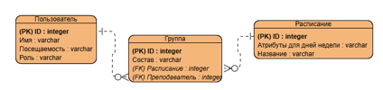

# Учет посещаемости занятий студентами.

## Описание проекта:
Проект представляет собой приложение, позволяющее отмечать присутствующих на занятии студентов, объединять их в группы, выставлять для них расписания и назначать для них преподавателей. 

## Цель проекта:
Облегчение работы преподавателя путем создания возможности легко отмечать присутствующих на занятиях студентов.

## Предметная область проекта:
1)	Учет студентов и учебных групп.
2)	Планирование занятий и составление расписаний.
3)	Фиксация факта отсутствия или присутствия студента на занятии.
4)	Хранение и обработка информации о посещаемости.
5)	Предоставление отчетов о посещаемости при необходимости.

## Пользователи системы

1)  Администратор – Может: создавать, редактировать и просматривать учебные группы, выставлять и просматривать их расписания, назначать для групп преподавателей, просматривать информацию о посещаемости любых студентов, создавать и редактировать варианты расписаний, создавать, просматривать преподавательские и студенческие профили.
2)  Преподаватель – Может: изменять информацию о посещаемости студентов из определенных групп, просматривать информацию о посещаемости любых студентов, просматривать информацию о группах, пользователях и расписаниях.
3)  Студент – Может: просматривать свою собственную информацию о посещаемости, просматривать информацию о своем расписании и своей группе.

## Функции системы
1)	Создание, изменение и просмотр учебных групп из студентов и расписаний для них.
2)	Добавление, изменение и просмотр учетных записей пользователей.
3)	Вход и выход из учетных записей.
4)	Возможность редактирования и получения информации о посещаемости студентов.

## Архитектура и способ реализации
Проект будет представлять собой консольную программу, написанную на языке программирования Python, данные будут храниться в локальной базе данных SQLite.

